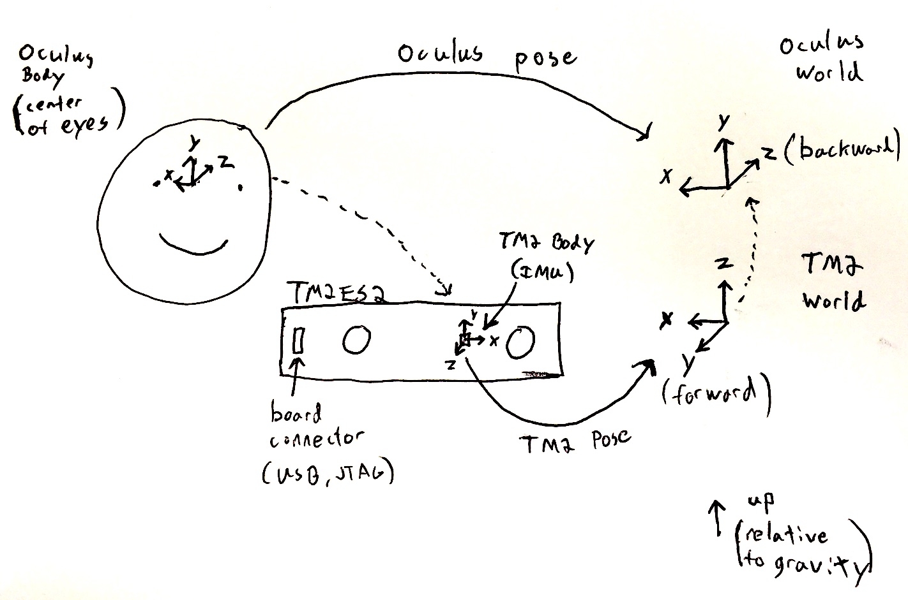

# Coordinate systems

6DoF poses are defined as the transformation between the "body" and
"world" coordinate systems.

Before we can use a pose, we need to understand the body and world
coordinate systems we have, and the body and world coordinate systems
we want in the system which consumes the pose.

Our default world coordinate system has +z pointed up (relative to
gravity), +y pointed forward (aligned as much as possible with our
startup position) and +x pointed to the right. This can be changed
with `rc_configureWorld`.

Our body coordinates system is defined by the reference frame which
all sensor extrinsics are provided relative to in the calibration or
via `rc_configure*`.

# TM2 ES2 to Oculus

To illustrate how these coordinate systems are used in a real world
application, we will use the following illustration:



In this setting, the world and body coordinate systems are in the
default setup (defined above). However, the desired output is a
transformation from Oculus body to the Oculus world coordinate
systems.

The Oculus world coordinate system has +y pointed up, +x pointed to
the right, and +z pointed backwards. 

The Oculus body coordinate system is centered on the center of the
eyes, with +x pointed toward the right eye, +y pointed toward the top
of the head, and +z pointed toward the center of the head.

We often name transformations with the letter `G`. Let's call the 6DoF
pose `G_TM2Body_to_TM2World` to indicate it is a transformation from
the TM2 Body to the TM2 World. The transformation we want is
`G_OculusBody_to_OculusWorld`. These are drawn in the figure with
solid arrows.

In order to get `G_OculusBody_to_OculusWorld` using
`G_TM2Body_to_TM2World`, we need to draw a set of transformations we
can compose that start and end at the same place as
`G_OculusBody_to_OculusWorld`. These extra transformations are drawn
with dotted lines, and are:

- The transformation from the Oculus body (center of eyes) to the TM2
  body (center of the IMU). Let's call this one
  `G_OculusBody_to_TM2Body`. It includes both the rotation between the
  coordinate systems and the translation from the center of the eyes
  to the center of the IMU (in the coordinate system of the IMU).
- The transformation from the TM2 world to the Oculus world. Let's
  call this `G_TM2World_to_OculusWorld`.

Now we can compose transformations by following the arrows on the
diagram to get what we want:

```
G_OculusBody_to_OculusWorld = G_TM2World_to_OculusWorld * G_TM2Body_to_TM2World * G_OculusBody_to_TM2Body
```

# The origin

The origin in both coordinate systems is defined to be the `0,0,0` for
the first pose (note there will be an initial non-identity rotation
relative to gravity). However, we added a translation (from the eyes
to the IMU) in our transforms above, so the first pose will not be
`0,0,0`, but instead will correspond to some rotation of this offset.
The easiest way to compensate for it is to record the translation
portion of this first pose and apply the inverse of it to all future
poses.

# Prediction

If we want to predict ahead in time, we can follow the prediction code
in `rc_predictPose` defined in
[rc_tracker.h](../src/tracker/rc_tracker.h) which uses both the
current estimate of the acceleration and velocity to predict a pose in
the future. Note that this predicted pose should be computed in the
same reference frame as the 6DoF pose above.

In VR, prediction is extremely important to reduce perceived latency.
However, it is not a magic solution to all latency. Predicting far
into the future (more than 50-60ms) can have visible artifacts for
some types of motion. Work hard to minimize all latency in the
pipeline between the poses and the rendering.
[Read this blog post](https://developer3.oculus.com/blog/the-latent-power-of-prediction/)
for a treatment of latency and error with prediction
in a VR setting.
