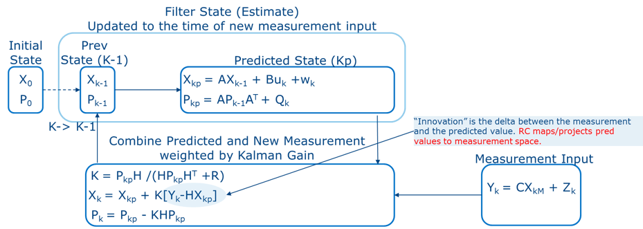
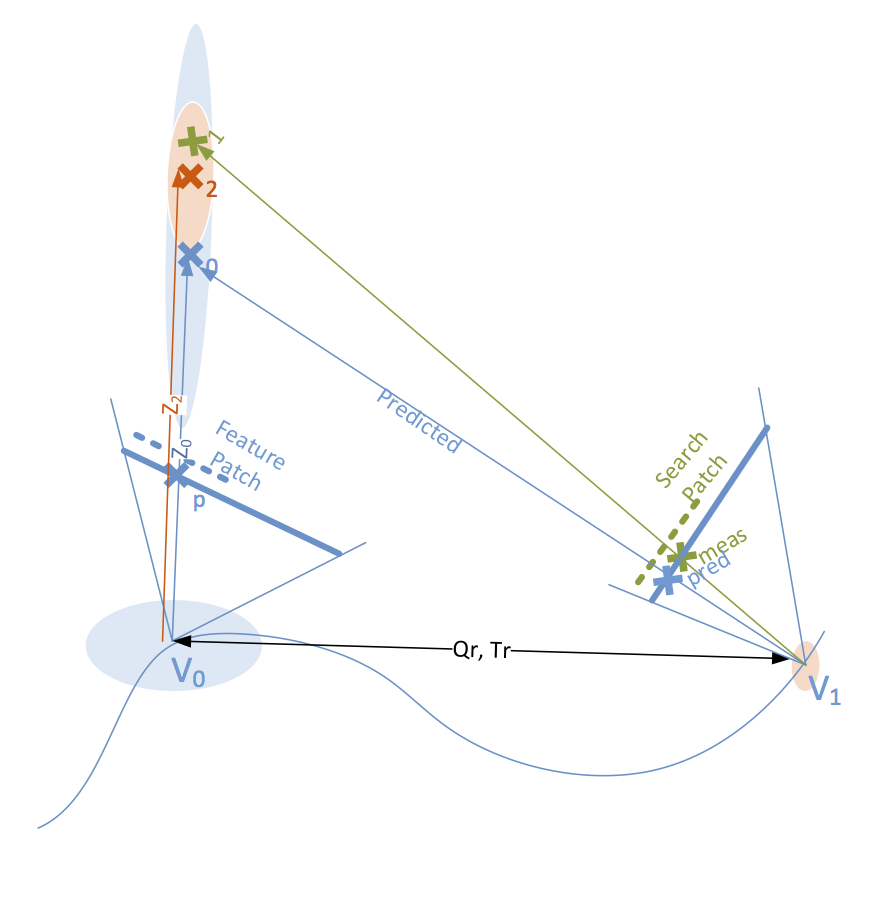
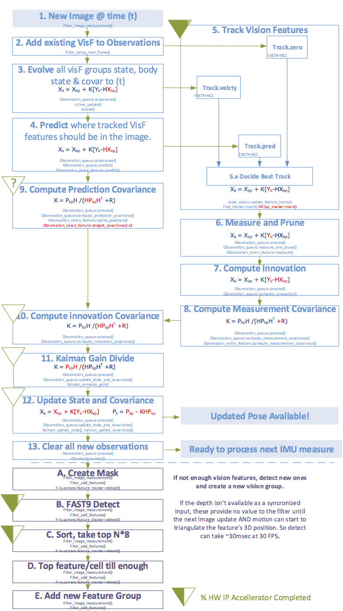
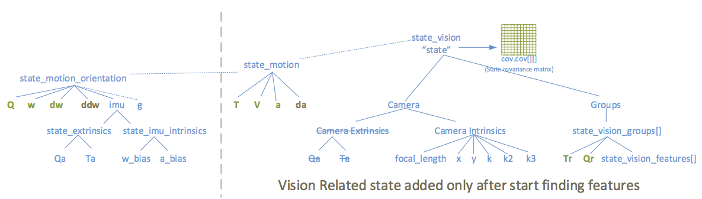
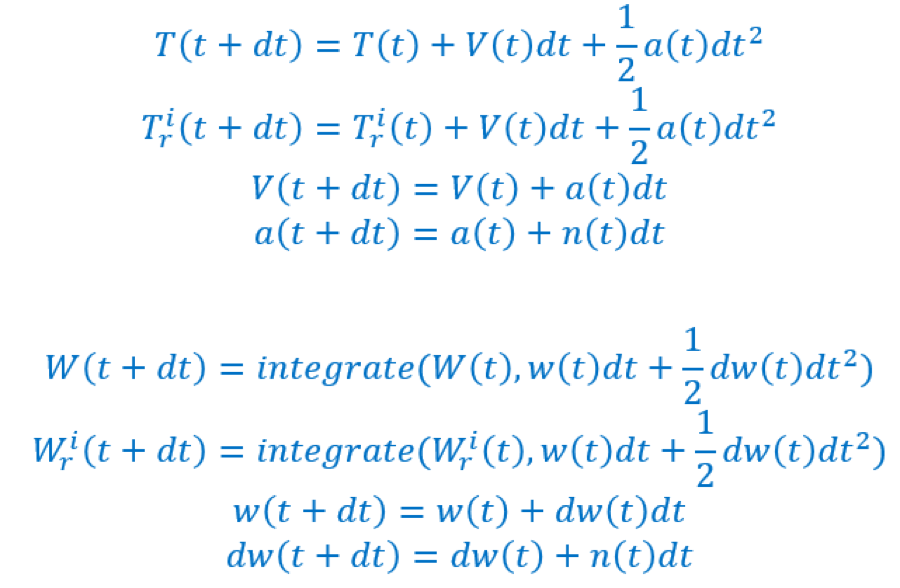
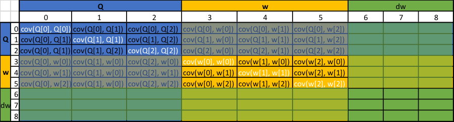

# Table of Contents

1. [Definitions](#definitions)
1. [Kalman Filter](#kalman-filter)
1. [Vision Features](#vision-features)
    1. [Vision Features and Filter Update Overview](#vision-features-filter-update)
    1. [Vision Features and EKF Code Flow Overview](#vision-features-ekf)
1. [State and Covariance](#state-and-covariance)
    1. [State variables](#state-variables)
    1. [State Dynamics](#state-dynamics)
    1. [Tracking State](#tracking-state)
    1. [The state covariance matrix](#state-covariance-matrix)
    1. [Sparse EKF calculations](#state-sparse-ekf)
        1. [Sparse matrix multiply](#state-sparse-mul)

<a name="definitions">
# Definitions
In the below description, various terms are in **bold** that
correspond to terminology used in the algorithm and software.

The algorithm for 6DoF inputs sensors data (motion cameras, IMU gyro
and accelerometer). Features are **detected** at (x,y) locations in
the images and then **tracked** frame to frame, only detecting new
features if the code is no longer able to track existing ones. The
combination of the (x,y) location of these image features and the
incoming gyro and accelerometer data make up the "measurements".

The algorithm also maintains **state** which it is
modeling/estimating. This state can't always be observed directly, but
it can be estimated based on Newtonian motion equations that allow the
state as well as estimated uncertainty with the model to **evolve**
with time. For example, position in the 3D world evolves or changes
with time based on computed velocity and acceleration. This state
includes the position and orientation of the drone or user's head
which is the final desired output from the 6DoF algorithm.

New incoming measurements can (via a lot of math) provide updates to
the model/estimate. Combining and weighting of new measurement data
with the model depends on the computed uncertainty of each. This
combining is done using an **Extended Kalman Filter (EKF)**. When a
new measurement comes in that was sensed at time (t), the model and
its uncertainty/**covariance** is **evolved** to the (t) and then
based on that model, a **prediction** is made by **projecting** the
**state** from state space to measurement space as to what the
incoming measurement should be based on the model. The difference
between the prediction and measurement is the **innovation**. This
innovation and the covariance of the model and measurement is used to
then update the model. This model is also referred to as the filter.

Incoming data can at times have data points that are completely out of
sync with what's being modeled. Examples of these **outliers**, which
are generally vision features, could include:

- Vision feature located in a moving object rather than the background
  scene.
- A foreground and background object appearing to intersect in the
  image and thus forming a feature which then appears to move/crawl in
  the image as the viewpoint changes and this "intersection" moves.

Identifying and quickly throwing out outlier data is critical to
maintaining the robustness of the filter. A technique called **1pt
RANSAC** is being added which randomly picks a single state variable
(always a vision feature?), runs it through the filter and checks to
see which state agrees (inliers) and which state disagrees (outliers)
based on some threshold. "Agreement" is already provided by the
covariance matrix. Since it's possible the one point was itself an
outlier, this is repeated a few times since the risk of picking say 3
outliers in a row, especially ones that all agree, is remote.

<a name="kalman-filter">
# Kalman Filter

The basic Kalman filter and equations are shown in the above figure.
The process takes an initial estimate (which doesn't need to be that
accurate) of state and uncertainty (covariance). It updates this based
on time and a physical model such as the laws of motion, adds noise in
this modeling, and finally does whatever math and transforms are
required to move from the state being estimated to the space of what
can be measured. A measurement is then taken and the predicted and
actual measurements and their uncertainties are combined to come up
with a better estimation of the state and covariance of the
model/filter. This process is repeated for every new measurement
resulting in a more refined model. The KF is known to be the best
estimate of a linear system with Gaussian noise.

The Kalman Filter assumes a linear model. To account for non-linear
models, which 6DoF requires, the Extended Kalman Filter (EKF) is used.
The basics are the same, but the use of a derivative and more math is
required. Terms are:

| Literature | Code | Description |
|------------|------|-------------|
| Xkp | | State being modeled/estimated, after being evolved to the current time. |
| Xkm | | New Measurements. |
| P   | `C[][]` | Process covariance |
| R   | `observation_queue::m_cov[][]` | Uncertainty with the sensor data. For vision, changes over time due to outlier rejection. For gyro/accel, static after calibration. |
| K   | `K[][]` | Kalman Gain. |
| A   | | Physical modeling that takes state and advances with time (evolves). The motion equations. |
| Buk | | Portions of the motion equations not part of the estimated state, such as gravity. |
| W   | | |
| Z   | | |
| Q   | | Noise in the physical modeling. Can be zero or a constant, but zero will eventually cause new incoming measurements to be ignored, so usually want to add some. RC code has a time-dependent Q since the errors in the model grow with time from the last measurement. |
| H   | | Transformations from one state to measurement space. |
| C   | | Can be used to map from measurement space to state space, and often identity. Not used in RC code because state space is mapped to measurement space. |

The real trick to the EKF is the weighing of incoming measurements vs.
the model's estimate. This is controlled by the Kalman Gain (K) which
ranges from (0..1) with larger values meaning more weight is put on
the incoming measurements. As with an iterative average formula, K
would tend to go down to zero and place less weight on new
measurements over time if it wasn't for the Q term which forces
uncertainty in the model to be acknowledged so new data always has
some influence.

<a name="vision-features">
# Vision Features

Features are found in a camera image. Then, using the filter's
prediction of the depth of that feature and the camera's pose, the
filter estimates where in a new image that feature is expected to be.
It then re-finds or tracks (measures) where it actually shows up, and
uses the difference between the predicted and measured values to
update the filter to make a better prediction of the feature's
location and the camera pose next time.  The steps for doing this will
first be described at a higher level with reference to a figure, and
then at a lower level reflecting steps taken by the software.

<a name="vision-features-filter-update">
## Vision Features and Filter Update Overview

In the figure, the camera is moving along a path. The actual position
and orientation of the camera is not known, but is being estimated and
refined by the Kalman Filter. At position/time V0, it has an
uncertainty denoted by a blue cloud. At V0, the system has no vision
features it is tracking so it detects new features at (X,Y) locations
in the image plane which for the one feature shown here is denoted as
Xp. This is a measurement. The feature's depth (Z0) is unknown and
thus the feature's position in the 3D world (X0) is also unknown. An
initial estimate of the depth and degree of uncertainty is required to
seed the Filter and hard-coded values are used. The degree of
uncertainty in the features depth from Z0 is initially very large and
is also denoted by a blue cloud. The position of the camera relative
to the current camera is saved (at detection time these are the same
as the identify matrix is used). A patch of the image around the
feature is also saved to aid with tracking.

The camera continues to move to position/time V1 where a new image is
available. The filter is estimating the camera's pose, angular and
linear velocities, and acceleration and uses the elapsed time to
update the camera pose to the time of V1 based on standard motion
equations. It also updates the transforms (Qr, Tr) that get you from
V0 where a group of features were detected, to the new camera pose.
Given the filter now believes it knows where the camera is, it needs
to take Xp, Z0, Qr, and Tr and predict where it thinks X0 will fall in
the new V1 image plane - an (X,Y) position denoted by Xpred.  Two
other methods of estimating Xpred would be to simply track the
velocity of the feature in the image plane (dXdt,dYdt) or assume it
doesn't move at all. Based on these three predictions for Xpred, the
tracker searches neighboring pixels looking for features, and for any
it finds, it compares the delta between the saved patch of X0 and the
patch at the newly found feature and if they appear "close", conclude
we've found the same feature at Xmeas. If it can't be found, the
feature is no longer visible (could be occluded) or the patch just
doesn't match (a corner of a building can look different from
different viewpoints). In this case, the feature is dropped. If enough
are dropped, new features need to be detected and added. With Xmeas
and Xpred, the filter is updated and a new estimate for the feature's
distance from the original viewpoint where it was found (V0) can be
made (Z2) which now has less uncertainty (denoted by the smaller red
cloud around X2). This also gives us a better estimate for the camera
pose denoted by the small red cloud around V1. This process continues
to iterate and refine both feature locations and camera pose.

<a name="vision-features-ekf">
## Vision Features and EKF Code Flow Overview

The below diagram shows the RC 6DoF code flow for vision features and
how this ties into the EKF. The code flow is sequential and follows
the numbering shown. However, the diagram shows that from a dependency
perspective, 2 of the 3 parts of tracking could actually be done
earlier. It also shows step "9: Compute Prediction Covariance" could
most likely be done before tracking since tracking is all about
getting a new vision measurement. The dependency tracking will become
important as we look to accelerate functions by exploiting parallel
execution.

Steps 1-12 are the path from getting a new vision image frame to when
that image frame can result in an update to the camera pose.

Steps 13 is also required before the next measurement which is always
going to be from the IMU (gyro/accel) since these sample so much
faster than motion cameras. It's a minor housekeeping step shown for
clarity.

Steps A-E is the detect path which is used to detect more features in
the image if the number of features being tracked drops below a
threshold. Notice that these features are kept in an uninitialized
state if no depth information is available. Depth would need to come
from a depth camera, stereo optic flow, or depth from motion. Newly
detected features don't impact the current pass, but should be ready
by the next measurement.

6DoF performance is about 1) accurate modeling and tracking of camera
pose and 2) responsiveness. The compute intensive portions of the
vision flow are:

1. Tracking.
2. Detect and Sort.
3. Kalman divide, state update and covariance update (dense matrix ops)
4. Project Covariance, specialized sparse matrix ops

A description of these states follows:

1. New Image. A new bit grayscale image that was captured at the
   fisheye camera at time (t) is available to the RC software and the
   software has processed all other observations/measurements up to
   time (t).
2. Add existing VisF to Observation. Vision "features" (unique
   signatures in an image which for RC 6DoF are corners with a
   surrounding patch) previously found, and any gyro or
   acceleratometer data that happened to also be captured at the IMU
   sensor exactly at time (t), are put in to the observation queue.
3. Evolve.
    1. Evolve State. The body can have velocity and/or acceleration so
       that its pose/state and velocity (Q, T, w, V) change with time
       (dt). In addition, When image features were detected at a prior
       time, they were placed in a group (see steps A-E). This group
       has an orientation and position (`g->Qr`, `g->Tr`) that is it
       relative to the body pose and thus also changes with time (dt).
       In the evolve step, this state is advanced to the time this
       incoming image data was captured at the sensor (t).
    1. Evolve Covariance. Because unknowns and un-modelled behavior
       grow with time, the covariance (measure of uncertainty) must
       also be evolved to time (t). Because the IMU covariance is
       coorelated to the vision feature variance, the vision feature
       state and variance must be updated even for a simple IMU
       update. This means step 3a still happens if a gyroscope
       measurement occurs.
    1. Note: I'm missing in the code where evolve()'s poly-phorph
       knows its dealing with vis, accel, or gyro. All pass `f->s` to the
       _measure() code.
4. Predict. After evolve, the model state is now at the same time as
   the incoming measurement. For the Kalman Filter to understand how
   well it's doing, we must use the model to predict where the new
   measurement (in this case vision features) will be measured at
   (where they will show up in the new image given the updated
   viewport of the camera). This is where it becomes iterative. The
   estimated 3D world position of the vision features refines the
   actual camera pose estimation and the refined pose estimation makes
   it more accurate and predicting where the vision features will show
   up in new motion image captures. Prediction involves taking the 3D
   location of a feature as viewed from the viewport where is was
   includes the following steps, while referring to the figures above:
    1. Normalize initial (X,Y) image location Xp to the range
       ((0..1),(0..1))
    1. Undistort to remove lens effects
    1. Project out into the 3D world location by scaling by depth
       (find X0)
    1. Rotate and Translate from the detect viewport to the current
       viewport (`Qr`,`Tr`)
    1. Flatten to the image plane by multiplying by inv depth and
       dividing by Z.
    1. Re-introduce lens effects by distorting.
    1. Unnormalize to change image scale from ((0..1),(0..1)) to
       ((0..image.w), 0..image.h))
    1. Save results in `observation_vision_feature::pred[]`
5. Track Vision Features. For each vision feature, we want to find
   where it is in the new image by comparing a signature of the saved
   feature, to candidate features in the new image. This signature is
   an image patch and a "match" is when the NCC score is above a
   threshold.  Rather than search the entire image, which would take
   excess time and could result in false matches, three candidate
   regions are searched, stopping as soon as one matches with a good
   enough score. The candidates in order:
    1. Feature velocity – The (X,Y) velocity in image space of the
       feature from the last two frames is used with time to predict
       where it will be in this frame.
    1. The filter prediction computed in step 4.
    1. dX=dY=0. If it still isn't found after 5a and 5b, try looking
       where it was last frame.
    1. If the feature still can't be found, then it is dropped and no
       longer part of the filter state. Note that in theory, 5b should be
       the best but that hasn't proven out in practice. Also, there is an
       alternative trackerr (ipp_tracker) in the code that hasn't been
       evaluated yet.
6. Measure and Prune: This Updates the per feature variance, stddev,
   and mean and throws away vision features that are too close or
   behind the camera. This may trigger a new prediction for features
   that were still initializing.
7. Compute Innovation. "Innovation" is just the delta between the
   predicted and measured values. Each observation keeps
   `inn[]=meas[]=pred[]` and all the `inn[]` are collected into a single
   array: `observation_queue::inn[]`.
8. Compute Measurement Covariance. Each vision feature computes
   variance (`m_cov[]`) in the innovation of its (X,Y) location.
   Collected into a single array for all observations:
   `observation_queue::m_cov[]`.
9. Compute Prediction Covariance. This is computing the uncertainty in
   the model. It uses an EKF because the filter isn't linear. This has
   a bunch of tricky math to speed up the spare matrix calculations
   but it is still a HUGE part of the time. It actually calls `log()`
   and `exp()` on the depth term. It will take me another week or more
   to fully understand this. Final results are stored in
   `observation_queue::res_cov[][]`.
10. Compute Innovation Covariance. Simply adds the innovation
    covariance to the prediction covariance to get the denominator of
    the Kalman Gain (`res_cov[][] += m_cov[][]`)
11. Kalman Gain Divide. This is a matrix transpose, copy, and then
    solve to take care of the matrix divide in computing the Kalman
    Gain.
12. Update State and Covariance. Standard full Matrix Multiple + Add
    for state and Multiply+Sub for Covariance. Symmetry enforcement
    for the cov matrix.
    a. At this point, the pose is now updated based on the image.
13. Clear all new observations. This is just code maintenance which
    clears out all gyro, accel, and vision images that were processed
    at this timestamp. Generally will have one of the three but not
    all of them
1.  (A) Create Mask. If not enough features are being tracked, new
    ones will be detected in this image. The first step is to create a
    mask that excludes 8x8 pixel cells that already have a feature
    showing up in them for being searched for new features. This is to
    avoid messing up measurement of features still being tracked.
1.  (B) FAST9 Detect. Using FAST9 corner detector, identify all features in
    the image that are not masked out by step A.
1.  (C) Sort. Only keep `N*8` of the top scoring detected features if
    N are needed.
1.  (D)Preserve only the top feature per 8x8 cell. This avoids false
    matches on features in the same cell causing noise.
1.  (E) Add newly found features to a single group with Qr=Tr=identity
    and put them in the list to be tracked next frame.

<a name="state-and-covariance">
# State and Covariance

<a name="state-variables">
## State variables

"State" are variables where we want to refine an initial estimation
using incoming measurements/observation. In general, the state is not
directly measureable, but can be used with some math to predict values
of things which can be measured and the difference between that
prediction and the actual measurement can be used to refine our
estimate of the true state. The RC state is:

- `T(t)`, `V(t)`, `a(t)` – Body/head position, velocity, and
  acceleration
- `Q(t)`, `w(t)`, `dw(t)` – Body/head orientation, angular velocity,
  and angular acceleration
- `Qa`, `Ta` – Position of the IMU (containing the accelerometer and
  gyro) relative to the body/head position
- `w_bias`, `a_bias` – Bias of the gyro and accelerometer. Currently
  zero.
- `g` – Gravity. Can change with location. Currently assumed static
  and not added to the state/filter for refinement.
- `focal_length`, `x`, `y`, `k`, `k2`, `k3` – Camera Calibration
  parameters. Only added to the filter if the initial values are to be
  refined dynamically. (Currently no)
- `Qa`, `Ta` – Camera position relative to the body. Only added to the
  filter if the initial values are to be refined dynamically.
  (Currently no).
- `Qr`, `Tr` – Position and orientation of feature group g relative to
  the current camera position. Groups are dynamically removed (when
  tracking fails for most of the features in the group) and added
  (when a lack of enough tracked features causes feature detect to run
  over the entire image).
- `state_vision_features[]` – Each vision feature has several tracked
  things, but the actual state that is added to the filter, and thus
  refined is the depth of the feature away from the camera at the time
  of detection. It actually stores the `log_depth`. 

Initially, only the `state_motion_orientation` (rotation state of the
body/head) are in the filter. This is because this state is highly
inaccurate initially and takes a bit of time to stabilize. The output
of the filter shouldn't be used during this initialization time.

<a name="state-dynamics">
## State Dynamics

The estimate of the state changes with time according to Newtonian
laws of motion. This is done as part of the `time_update()` and
`evolve()` functions in the code. Those laws of motion are:

<a name="tracking-state">
## Tracking State

All state being estimated/refined by the filter is kept in a tree
structure under a class `state_vision` also typedef'd to `state`.
Despite the "vision" name, this class is derived from `state_motion`
which is from `state_motion_orientation`. It therefore includes state
for the position and orientation of the head/body which is ultimately
what we want to estimate.

The state also includes the effective 3D position of all vision
features. To reduce state, features are left in a group which is all
features found in the same image. The camera viewport at the time that
group of features is captured in an image is tracked relative to the
current camera viewport (starts as identity). The initial (x,y)
position of each feature in the image is saved (static so not part of
the state). The depth of the feature from the original camera
position, through point (x,y) and out into the 3D world is all that's
required to know the features 3D location. This depth, along with Qr
and Tr for the group, is the state that needs to be estimated and
refined over time by the filter and is updated based on later images
finding the same feature from a different viewport. This is described
more in section Vision Features and Filter Update Overview.

The extrinsics of the IMU, intrinsics of the IMU, and intrinsics of
the camera have initial values which are either hard-code or given as
a result of calibration. Because of slight variations in
manufacturing, mounting, and environment, it's possible that these
values could be different for every system and change over time.
Therefore, this state can be added to the filter to enable the filter
to make measurements and refine these values over time. As of right
now, this capability is disabled.

Vision features are part of the state and because vision features are
constantly being removed (lost tracking on them) and added (during
detect), the "Groups" part of the state is constantly being updated.

<a name="state-covariance-matrix">
## The state covariance matrix

With some magic, the code maintains a state covariance matrix
(`s.cov.cov[][]`) that is free of blank columns/rows even as state is
being added/removed. Key to HW acceleration is:

- The matrix is square, with each side the size of all state
  (statesize). Because state is both along the rows and columns, the
  matrix is symmetrical across the diagonal and the diagonal contains
  the variance of a data value with itself. In some places, this
  symmetry is forced by the code to avoid numerical rounding etc.
  throwing it off.
- The memory for the matrix is a statically allocated, even though the
  effective # of rows/cols changes over time. So, the stride in memory
  is constant, but not the same as the #of rows * the statesize.
- All values are floats.
- A single state variable can often contain a vector of values
  (rotation vector for example has 3 floats).
- The covariance of some state, for example `intrinsics.a_bias`, is
  zero. Rather than put these in the matrix where they consume
  computes, the code variables refer to a static zero vector.
- Prior to adding features, the matrix is about 11x11 (w/out extrinsic
  and intrinsic refinement). The current max size of the state
  covariance matrix is 120x120 which gives a max of ~100 vision
  features that could be added. This limitation is mostly due to the
  N^3 computes required for growing the state.

<a name="state-sparse-ekf">
## Sparse EKF calculations

As part of the Kalman Filter, the updated covariance of the
estimation/prediction/filter and the measurement covariance must be
computed, combined, and then updated. Combining these requires
projection of the state space on to the measurement space. This
results in a significant portion of the compute time and thus is ripe
for HW acceleration.

Because most state dynamics are constant or involve one or two other
states, most predictions are derived from just a few states. Likewise,
the covariance calculations have large blocks of zero or ones. A huge
compute speedup can be achieved if these matrix multiplies only
consider state that could have an impact and hard-code those parts of
the matrix multiply. In addition, caching the jacobians only needs to
be done once per filter update and not per state/feature.

<a name="state-sparse-mul">
### Sparse matrix multiply

The "LC" matrix needs to be constructed which starts with the
projection of the state covariance matrix onto the measurement
covariance – cov(meas,state). With the coefficients, we could do a
full matrix multiply:

`LC = coeff[][]*state_cov[][]`

However, each observation type's covariance is only related to some of
state covariance which is shown below:

- Acceleration: `[Q[3], a[3], w[3], dw[3], g[3], a_bias[3], {Qa[3], Ta[3]}*]`
    - Data only: 3x6wide dot product (may optimize `g` and `a_bias`)
    - IMU extrinsics: 3x2wide dot product
- Gyroscope: `[w[3], w_bias[3], {Qa[3]}*]`
    - Data only: 3x2wide dot product. May optimize `w_bias`
    - IMU extrinsics: 3x1wide dot product
- Vision Feature: `[log_depth, Qr[3], Tr[3], {Qc[3], Tc[3]}**,
  {focal_length, x, y, k1, k2, k3}***]`
    - Data only: 2x7wide dot product
    - Extrinsics: 2x6wide dot product
    - Intrinsics: 2x6wide dot product

\* Only if IMU extrinsics are in the state and being refined by the
filter.

\*\* Only if Camera extrinsics are in the state and being refined by
the filter.

\*\*\* Only if Camera intrinsics are in the state and being refined by
the filter.

Note: These are the dependencies after the filter and vision features
are initialized. There is reduced state during initialization.

In the example shown in the following figures, there are four
observations: An acceleration from the IMU, and three features that
are being tracked. The LC matrix has observations for rows and all
state for columns. Projection of state covariance unto measurements is
done by walking the observations/rows of the LC matrix and for each
state/column of that observation/row, finding the state/row in the
state covariance matrix and making a linear combination of only the
state/columns that could possibly impact that observation's
covariance. The weights for the linear combination are calculated in
the `cache_jacobian()` routines and are not covered in this section.
